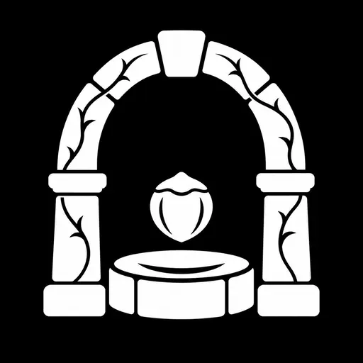

<p align="center"></p>

# Connla

**我们想让 Connla 成为目前最轻量、也最完整的个人知识库。**

记录一个念头不该先建目录，保存一份资料也不该先设计体系。Connla 用极简而美观的界面，把知识管理收束为三个容易理解的动作：**收进来、找得到、想明白**。记录、导入、搜索和制作卡片都尽量顺手，不需要先学复杂概念或配置一套工作流。即使第一次接触个人知识库，也能从一条想法、一份文档开始，慢慢建立自己的知识体系。

它以本地使用为主。随手记录、文档收件箱、全文搜索、主题和知识卡片彼此衔接，却不要求你一开始就分类、套模板或接入 AI。先用起来，结构可以随着理解慢慢长出来。

## 名字的由来

> *Tipra Chonnlai, ba mór muirn,*<br>
> *bói fon aibeis eochar-guirm.*
>
> 康拉之井，泉声浩荡，深藏于碧蓝之海下。

——[《Sinann II》古爱尔兰语原文](https://celt.ucc.ie/published/G106500C/text054.html)，中文意译。

Connla 取自爱尔兰传说中的 *Connla's Well*。在《Sinann II》中，九株榛树的果实落入井中，被鲑鱼食用；数条河流也从井中发源。我们借用这口“智慧之井”的意象：知识有来源，理解需要沉淀，而好的想法终会继续流动。

## 图标的含义

图标将智慧之井化为一枚简洁的黑白印记。石拱门像通往知识的入口；缠绕其上的荆棘，象征探索中的阻力与守护；中央榛果般的符号呼应传说中的智慧种子，下方井口则接住它。我们选择复古、克制的线条，希望它既有庄严感，也能在很小的应用图标上被认出来。

## 一个轻量的知识闭环

1. **收进来**：记下一个念头，或导入 TXT、Markdown、PDF、DOCX、XLSX 文档。原文件完整保留；提取的文字是可重新生成的内容，不会改写原件。
2. **找得到**：用全文搜索找回记录和文档，并按内容类型、文件格式、日期缩小范围。无需靠复杂目录记住每份资料放在哪里。
3. **想明白**：按主题聚合材料，把值得留下的认识写成知识卡片。引用原文时，依据与自己的理解分开保存。

这就是 Connla 的设计方向：**尽可能少的操作，覆盖个人知识从进入、找回到沉淀的完整过程。**

## 为什么选择 Connla

- **轻，不是空**：从快速记录开始，需要时再使用主题、卡片和筛选；界面不强迫你维护一套庞大的层级。
- **材料有来处**：保留上传的原件，卡片可以关联原文，回看时能分清“资料说了什么”和“我理解了什么”。
- **核心流程不依赖 AI**：导入、阅读、搜索和整理都能独立使用。
- **数据留在自己手里**：面向单机 SQLite 使用，提供本地备份与恢复；Windows 本地版仅监听 `127.0.0.1:8081`。

当前边界也很明确：旧版 `.doc` / `.xls` 可保存原件，但不解析正文；扫描版 PDF 暂无 OCR。AI 自动生成和复习功能不在当前版本范围内。

## 从源码运行

本仓库只发布源码，不包含个人数据、备份或预编译的 Windows 程序。开发环境需要 Go 1.27、Node.js 24 和 pnpm 11。仓库保留了 Memos 原有的 Go module 路径及部分内部命名，以兼容现有代码和生成文件；产品名称为 Connla。

```powershell
cd web
pnpm install --frozen-lockfile
pnpm release
cd ..
go run ./cmd/memos --addr 127.0.0.1 --port 8081
```

在浏览器访问 `http://127.0.0.1:8081/`。第一次使用时创建管理员账号。Windows 本地版的构建、启动和数据位置见 [使用说明](docs/LOCAL_WINDOWS.md)；备份和恢复见 [备份说明](docs/BACKUP_RESTORE.md)。请妥善保管密码，定期把备份复制到另一块磁盘，不要把个人数据目录提交到公开仓库。

## 开发检查

```powershell
go test ./...
cd web
pnpm lint
pnpm test
pnpm build
```

部分 Go 存储测试需要 Docker。协议文件的检查命令是 `cd proto; buf lint`。如果修改 `.proto`，请按仓库原有流程重新生成 Go、TypeScript 和 OpenAPI 文件。

## 来源与许可

Connla 基于 MIT 许可的 [Memos](https://github.com/usememos/memos)；保留了其 [MIT 许可证与署名](LICENSE)。其他已引入组件见 [第三方声明](THIRD_PARTY_NOTICES.md)。

软件源码按根目录的 MIT 许可证开放，但 Connla 名称和图标不随源码授权。图标由项目作者提供，单独保留权利；详情见 [品牌资产说明](BRAND_ASSETS.md)。如果你发布衍生版本，请更换名称和图标，并保留适用的源码许可证及署名。

如果你也相信，好的工具可以既简单又美，欢迎关注我。Connla 只是开始，下一件作品，我们再见。
